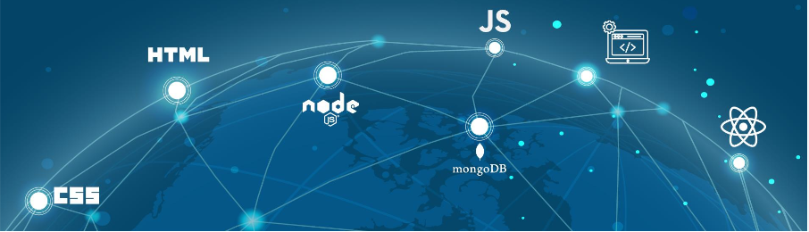

<h1 align="center">
Hey there!
, I'm Emmanuel Balikuddembe
</h1>
  
Hi, i'm Balikuddembe Emmanuel, a passionate self-taught full stack developer from Uganda in EastAfrica.I have learnt a lot from the open-source community,on-line bootcamps and i love how collaboration and knowledge sharing happen through open-source.

- 🔭  I’m currently working on a migration of a Safety Management System from a PHP Framwork to a Java Framework & React Front End. Also working on a Library Management System for a High school in React and Java Spring.
- My most recent accomplishment: Developed a React Native Expo app (with a Java Backend) that helps farmers purchase farming supplies on credit basing on their credit score and integrated it with the MTN Mobile Money API. The app won the hackathon.
- ☎️ I’m on the look out for remote full stack web development opportunities
-  My next learning goals are developing cloud based solutions (using AWS) & using CI/CD tools (such as Docker)
- 💬 ask me anything about Soccer.
- ⚡ Fun fact: I find joy in both coding and gaming. 

<h3>languages and tools:</h3>
</img>

               

## GitHub stats 🚀:

